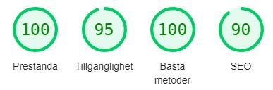
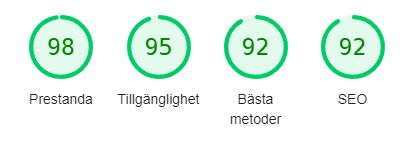

# RPS Game

The easy and simple Rock, Paper, Scizor game also including the popular options Lizard and Spock.
Made famous by the TV-show The Big Bang Theory.

RPS Game provides an easy to use game versus the AI to determine who has the most skill or should
we say luck. No reason to drag it on for too long, get gaming and try to beat the AI!

[View RPS Game live project here](https://chrisgustafsson.github.io/rpsgame-PP2/)

- - -

## User Experience (UX)

Purpose of the page is to provide a very easy option to play a game of rock, paper, scizor, lizard and spock.
One page site with everything possible to do in front of the user.

### User Stories (Goals)

* First time visitor
  * Learn through practice which pick beat which pick
  * Try out the functionality

* Returning visitor
  * Beat the AI
  * Set personal challenges and reach streaks of wins

* Frequent user
  * Master the game of luck

- - -

## Features

* Easy to play and test your luck against a randomized opponent
* Reset the game when scores are not looking that nice anymore
* Responsive flow

### Existing Features

* Logo
  * Connected to header element
  * Main purpose of logotype but also doubling as a guide

* Picks
  * 5 options to pick from (Rock, Paper, Scizor, Lizard, Spock)
  * Key element for the games functionality

* Scores
  * Keep track of the scores
  * Updates automatically if you win or lose

* Results
  * Get informed by the result of your choice
  * Statement who won

* Reset
  * Reset the scores to 0 for yourself and the AI
  * Restart the game

- - -

## Future Features

* Difficulty changer
* Informative page regarding history of game
* Footer for contact-opportunities

- - -

## Design

* Colors used are cinnabar, pale dogwood, anti-flash white, office green and red
  * Office green / Red for the score tracker as win connected to green (good) and loss to red (bad)
  * Anti-flash white for button background to have strong contrast against the cinnabar
  * Cinnabar and Pale dogwood is pickedby inspiration from the logotype

* Typography
  *  Tilt Neon with sans-serif as a fallback
     *  Mainly picked due to it's modern vibe and fitting to a game

- - -

## Technologies Used

* [HTML5](https://en.wikipedia.org/wiki/HTML5)
* [CSS3](https://en.wikipedia.org/wiki/CSS)
* [JS](https://en.wikipedia.org/wiki/JavaScript)

- - -

## Frameworks, Libraries & Programs Used

* [Codeanywhere](https://codeanywhere.com/)
  * To write the code.
* [Git](https://git-scm.com)
  * Utilizing the Gitpod terminal to commit to Git and Push to GitHub
* [Github](https://github.com/)
  * Deployment of the website and storing the files online.
* [Google Fonts](https://fonts.google.com/)
  * Import font used for the page
* [Am I Responsive](https://ui.dev/amiresponsive)
  * Picture for the README file
* [Font Awesome](https://fontawesome.com/)
  * For hand icons

- - -

## Testing

The W3C Markup Validator, W3C CSS Validator and JSHint services were used to validate the page of the project to ensure there were no errors.

* [W3C Markup Validator](https://validator.w3.org/)
* [W3C CSS Validator](https://jigsaw.w3.org/css-validator/)
* [JSHint](https://jshint.com/)

### Validation results

* HTML
  

* CSS

* JS

### Manual testing

* Tested on browsers Google Chrome and Safari due to the most amount of traffic
* Devices used IPHONE 13, Samsung Galaxy S22, Desktop computer and laptop
* Help from family and friends to test and get a first impression
* Developer tools in Google Chrome
* Features have been thoroughly tested and checked on multiple occasions

### Lighthouse - Google Accesibility

 Desktop

 Mobile

- - -

## Deployment and local development

### GitHub Pages

GitHub Pages used to deploy live version of the website.

1. Log in to GitHub and locate [GitHub Repository RPS Game](https://github.com/chrisgustafsson/rpsgame-PP2)
2. At the top of the Repository(not the main navigation) locate "Settings" button on the menu.
3. Scroll down the Settings page until you locate "GitHub Pages".
4. Under "Source", click the dropdown menu "None" and select "Main" and click "Save".
5. The page will automatically refresh.
6. Scroll back to locate the now-published site [link](https://chrisgustafsson.github.io/rpsgame-PP2/) in the "GitHub Pages" section.

### Forking the GitHub Repository

By forking the repository, we make a copy of the original repository on our GitHub account to view and change without affecting the original repository by using these steps:

1. Log in to GitHub and locate [GitHub Repository RPS Game](https://github.com/chrisgustafsson/rpsgame-PP2)
2. At the top of the Repository(under the main navigation) locate "Fork" button.
3. Now you should have a copy of the original repository in your GitHub account.

### Local Clone

1. Log in to GitHub and locate [GitHub Repository RPS Game](https://github.com/chrisgustafsson/rpsgame-PP2)
2. Under the repository name click "Clone or download"
3. Click on the code button, select clone with HTTPS, SSH or GitHub CLI and copy the link shown.
4. Open Git Bash
5. Change the current working directory to the location where you want the cloned directory to be made.
6. Type `git clone` and then paste The URL copied in the step 3.
7. Press Enter and your local clone will be created.

- - -

## Credits

### Code

* README template provided by [Code Institute (template)](https://github.com/Code-Institute-Solutions/SampleREADME)
* Inspiration taken from the Love Maths walkthrough project that Code Institute provides
  * Mainly the simplicity in a easy game looking clean and stylish
* Understanding the setTimeout possibilities with JavaScript [BitDegree](https://www.bitdegree.org/learn/best-code-editor/javascript-settimeout-example-2)
* Title attributes to make buttons more accesible via [Stack Overflow](https://stackoverflow.com/questions/2238239/tooltips-for-button-elements)

### Content

* All copy was written by the developer
* Logotype provided through [Open Clip Art](https://openclipart.org/) and user [gonz4](https://openclipart.org/detail/325665/rock-paper-scissors-lizard-spock)
